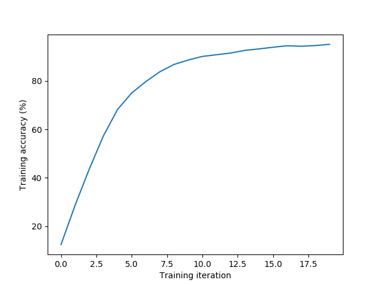
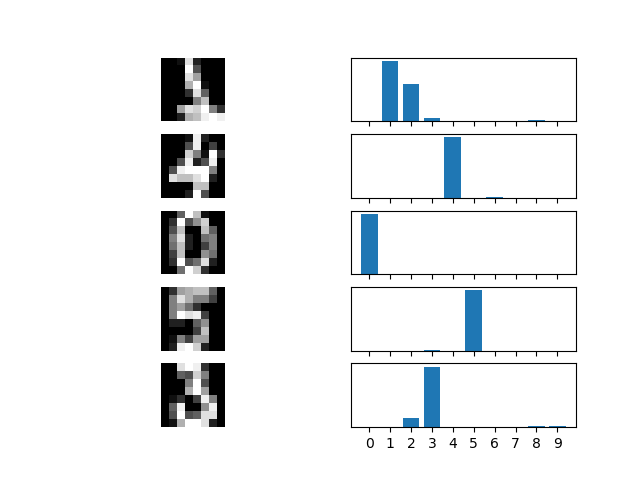

# NNNN: a Nth NumPy Neural Network

`nnnn.py` is a fully connected feed-forward neural network with stochastic gradient descent written in Python

## Features

* Activation functions: ReLU (`relu`), Sigmoid (`sigmoid`), Softmax (`softmax`), Linear (`linear`)
* Cost functions: Mean Square Error (`MSE`), Binary Cross-Entropy (`BCE`), Categorical Cross-Entropy (`CE`)
* Optimization algorithm: Stochastic Gradient Descent (truly stochastic)
* Only depends on NumPy
* Only 155 LOC/5 KB

## Usage

### Initialization

For a 3-layers network with a ReLU hidden layer, a Softmax output layer and 2-d inputs and outputs:

```
nnnn_structure = [
{'nodes':2, 'activation':None}, # input layer (no activation)
{'nodes':8, 'activation':relu},
{'nodes':2, 'activation':softmax}, # output layer
]

(w, b) = nnnn_init(nnnn_structure)
```

### Training

With input and output data `X` and `Y`, a Categorical Cross-Entropy cost function, a gradient descent rate of `0.01` and `1000` interations of the stochastic gradient descent:

```
nnnn_train(X, Y, alpha = 0.01, iterations = 1000, w, b, nnnn_structure)
```

#### Cost function

Setting the following activation functions in the output layer automatically default to the following cost functions:  
`sigmoid` → `BCE`  
`softmax` → `CE`  
`relu, linear` → `MSE`

To use the `MSE` cost function with a `sigmoid` activation function in the output layer, run:

```
nnnn_train(X, Y, alpha = 0.01, iterations = 1000, w, b, nnnn_structure, cost = 'MSE')
```

The cost functions `BCE` and `CE` require the training output data `Y` to be encoded as one-hot vectors

### Testing

With input data `X`:

```
Y_hat = nnnn_test(X, w, b, nnnn_structure)
```

### Data Formatting

* `X` is a NumPy array of dimension `(d, n)`
* `Y, Y_hat` are NumPy arrays of dimension `(c, n)`
* `d` is the dimension of the input data (input layer dimension)
* `c` is the number of classes/output variables  (output layer dimension)
* `n` is the number of samples

## Example

Testing NNNN on the MNIST digits dataset with 1 Sigmoid hidden layer, a Softmax output layer, a learning rate of 0.01, 20 training iterations, 1000 training samples and 797 testing samples (see `examples/examples.py`):  
Training accuracy: 95.1%  
Testing accuracy: 87.7%

Training | Testing
---------|--------
|

With 1 ReLU hidden layer and 50 iterations:  
Training accuracy: 100.%  
Testing accuracy: 91.7%

### More Examples

Check `examples/nnnn_examples.py` for more examples:
* Classification on the MNIST digits dataset (cf. above, requires [Scikit-Learn](https://scikit-learn.org/))
* Classification on the MNIST fashion dataset (requires [Keras](https://keras.io/))
* Regression on the Boston Housing dataset (requires [Scikit-Learn](https://scikit-learn.org/))

## References

* Backpropagation algorithm derivation in matrix form: https://sudeepraja.github.io/Neural/
* Cross-Entropy Loss functions and derivations: https://peterroelants.github.io/posts/cross-entropy-logistic/, https://peterroelants.github.io/posts/cross-entropy-softmax/
* Xavier initialization: https://philipperemy.github.io/xavier-initialization/
* Bias initialization: https://cs231n.github.io/neural-networks-2/

## To-Do

* Add regularization term
* Implement batch/mini-batch gradient descent
* Vectorize more
