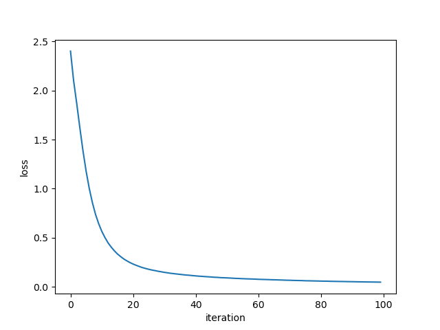
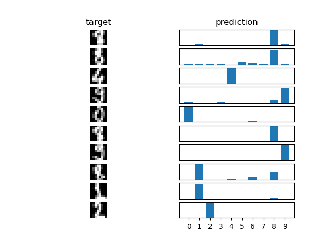

# NNNN: a Nth NumPy Neural Network

`NNNN` is a fully connected feedforward neural network with stochastic gradient descent written in Python+NumPy

## Features

* Supports classification and regression
* Depends on `numpy` only
* Weights < 200 LOC

## Usage

```python
from nnnn import NNNN

data_train = ...
data_test = ...

network = NNNN(layers = [64, 16, 10], regression = False)

network.train(data_train, target, rate = 0.001, alpha = 0.0001, iterations = 100)

prediction = network.predict(data_test)
```

### Initialization

```python
network = NNNN(layers = [64, 16, 10], regression = False)
```

* `layers: list[float]` is the network structure
* `layers[0] = n_dimensions` is the input dimension
* `layers[-1] = n_features` is the output dimension
* `regression: bool` optimize the network for regression if True, classification if False

### Training

```python
network.train(data_train, target, rate = 0.001, alpha = 0.0001, iterations = 100)
```

* `data_train.shape = (n_samples, n_dimensions)` is the input data
* `target.shape = (n_samples, n_dimensions) or (n_samples,)` is the output target
* `rate` is the training rate
* `alpha` is the regularization factor
* `iteration` is the number of training iterations

### Testing

```python
prediction = network.predict(data_test)
```

* `data_test.shape = (n_samples, n_dimensions)` is the input data
* `prediction.shape = (n_samples, n_dimensions) or (n_samples,)` is the output prediction

## Example

MNIST database with a 3 layers classification network, 1617 training samples and 180 testing samples
(see `examples/nnnn_example.py`)

Training|Testing
--------|-------
|

## Implementation

Activation functions:
* ReLU on the hidden layers
* No activation function on the output layer for regression
* Logistic on the output layer for binary classification
* Softmax on the output layer for multiclass classification

Optimization algorithm:
* Stochastic gradient descent with regularization on the network weights
* Mean squared error loss function for regression networks
* Mean cross-entropy loss function for classification networks

## Requirements

`numpy>=1.19.2`

## References

* Backpropagation algorithm derivation in matrix form: https://sudeepraja.github.io/Neural/
* Cross-entropy loss functions and derivations: https://peterroelants.github.io/posts/cross-entropy-logistic/, https://peterroelants.github.io/posts/cross-entropy-softmax/
* Input, weight and bias initialization: https://cs231n.github.io/neural-networks-2/
